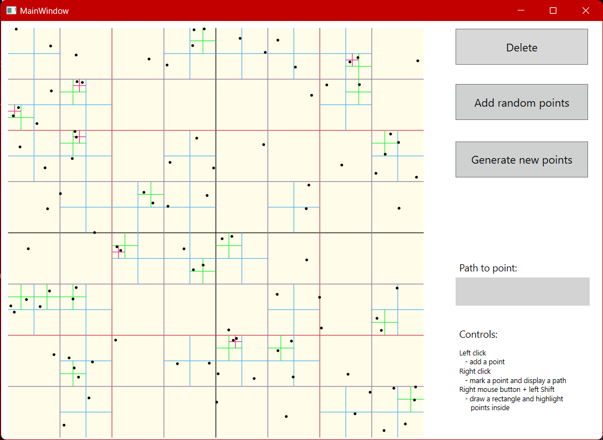

# Quadtree

A quadtree is a hierarchical data structure used in computer science and computational geometry. It recursively divides a two-dimensional space into four quadrants, or regions, to efficiently organize and manage spatial data. This tree-like structure enables quick searching, insertion, and deletion of elements based on their spatial coordinates.

